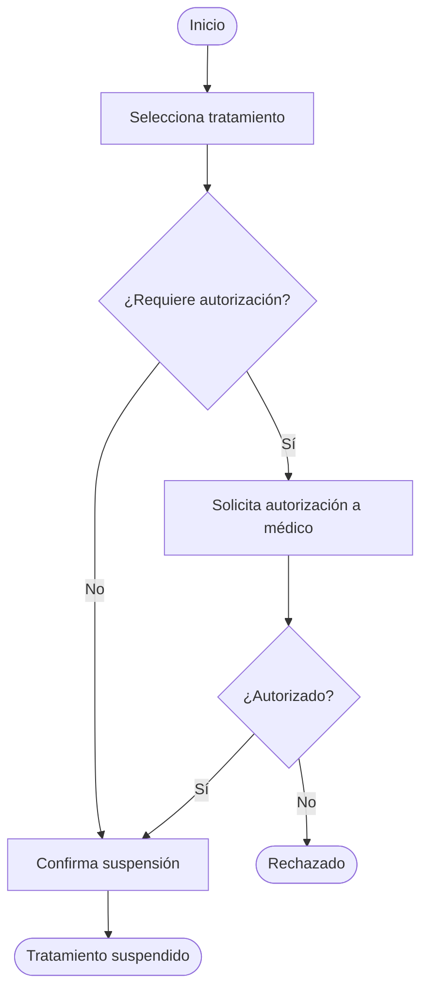
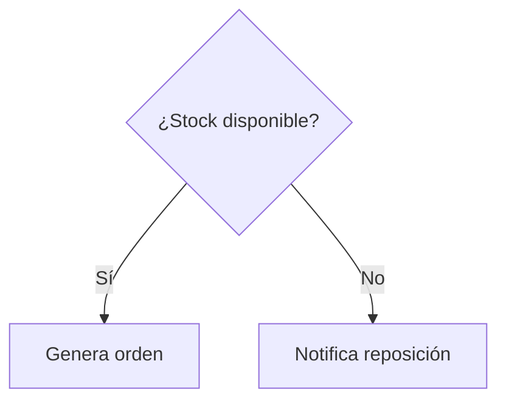
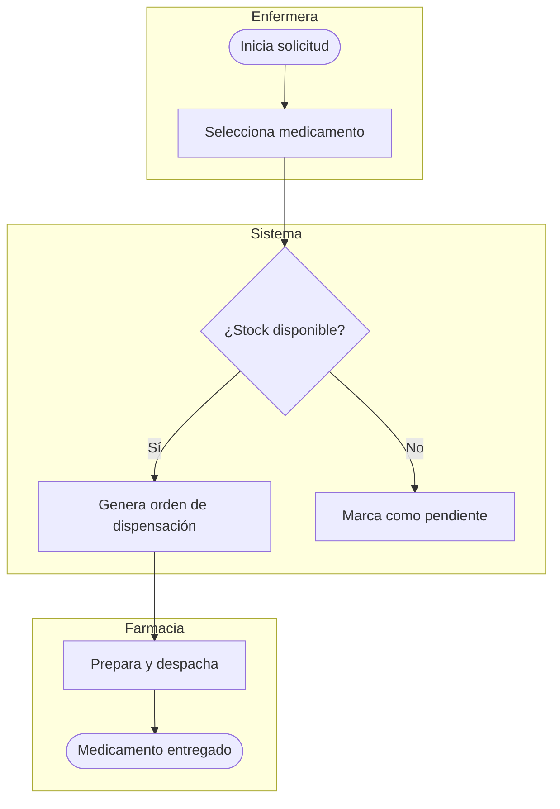
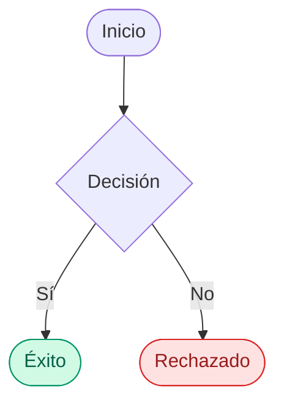

# Guía de sintaxis Mermaid para diagramas de flujo

Referencia rápida para generar `flowchart` de Mermaid consistentes al documentar flujos de producto.

## Estructura básica

`TD` = top-down (arriba hacia abajo). Usa `LR` (left-right) si el flujo tiene muchos pasos secuenciales y pocas ramificaciones — se lee mejor horizontal.

## Formas de nodo y su significado

| Sintaxis | Forma | Úsalo para |
|---|---|---|
| `A([Texto])` | Stadium (óvalo) | Nodos de inicio y fin |
| `A[Texto]` | Rectángulo | Paso de acción normal |
| `A{Texto}` | Rombo | Punto de decisión |
| `A[[Texto]]` | Rectángulo doble | Subproceso (referencia a otro flujo/diagrama) |
| `A[(Texto)]` | Cilindro | Almacenamiento de datos / base de datos |
| `A>Texto]` | Bandera | Nota o evento asíncrono (ej. notificación) |

No mezcles formas arbitrariamente — cada forma comunica algo específico. Si un paso no es ni acción, ni decisión, ni inicio/fin, probablemente sea un subproceso o una nota.

## Etiquetado de ramas en decisiones

Siempre etiqueta las flechas que salen de un rombo, nunca las dejes sin etiqueta:

Si la decisión tiene más de dos ramas (ej. estados múltiples), está bien tener más de dos flechas saliendo del mismo rombo — solo asegúrate de que las condiciones sean mutuamente excluyentes.

## Carriles por actor (swimlanes) con subgraph

Cuando el flujo involucra más de un actor (ej. enfermera, sistema, farmacia), usa `subgraph` para agrupar los pasos de cada uno. Esto hace mucho más legible quién hace qué:

Las flechas pueden cruzar entre subgraphs sin problema — Mermaid las dibuja igual.

## Estilos para estados finales (opcional)

Si quieres diferenciar visualmente los estados finales de éxito/error, usa `style` o `classDef` al final del diagrama:

Úsalo con moderación — solo para marcar estados terminales importantes, no para colorear todo el diagrama.

## Diagramas grandes: cuándo dividir

Si el flowchart supera ~15-20 nodos o mezcla varios subflujos independientes (ej. el flujo principal + un flujo de excepción completo), es mejor:

1. Hacer un diagrama principal de alto nivel con los subprocesos como nodos `[[Subproceso]]`.
2. Hacer diagramas separados para cada subproceso complejo.

Esto es preferible a un diagrama gigante ilegible. Dilo explícitamente al usuario si decides dividirlo así.

## Errores comunes a evitar

- No dejar flechas de decisión sin etiquetar.
- No usar rectángulos para decisiones (siempre rombos).
- No omitir el nodo de inicio o fin.
- No usar texto muy largo dentro de un nodo — si un paso necesita mucha explicación, resúmelo en el nodo y desarrolla el detalle en la documentación de texto (Paso 2 del proceso principal).
- No dejar nodos huérfanos (sin conexión de entrada o salida) salvo que sea intencional (ej. un estado de error alcanzable desde múltiples puntos).
